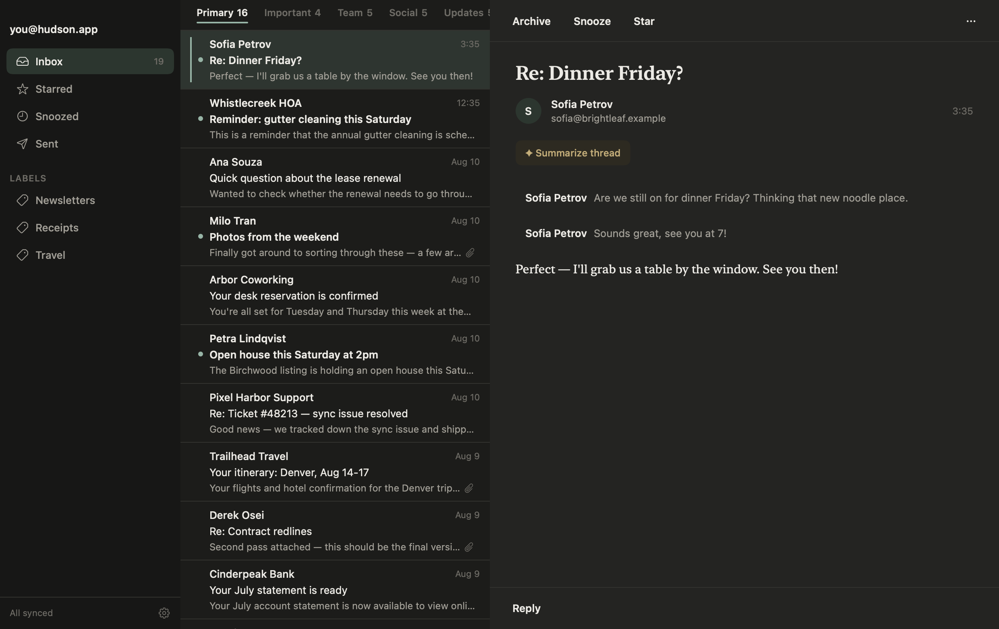
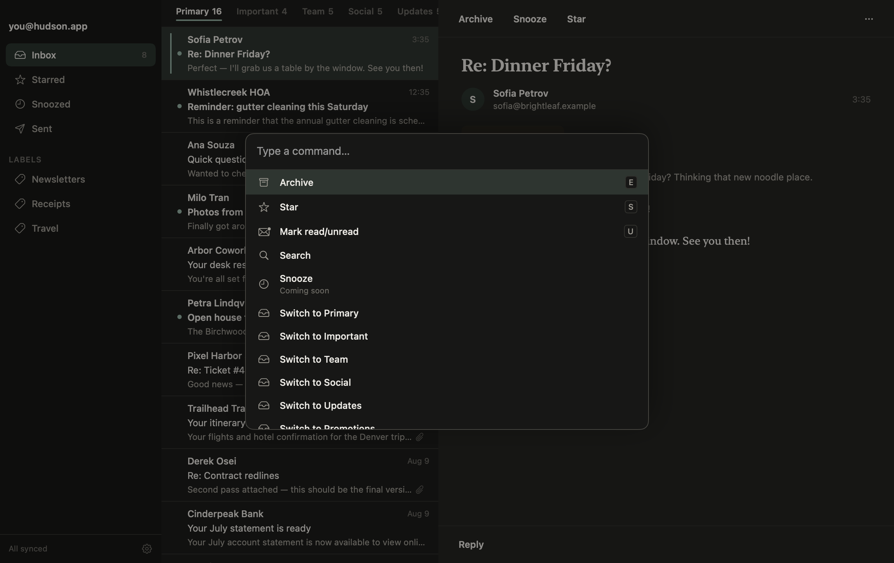
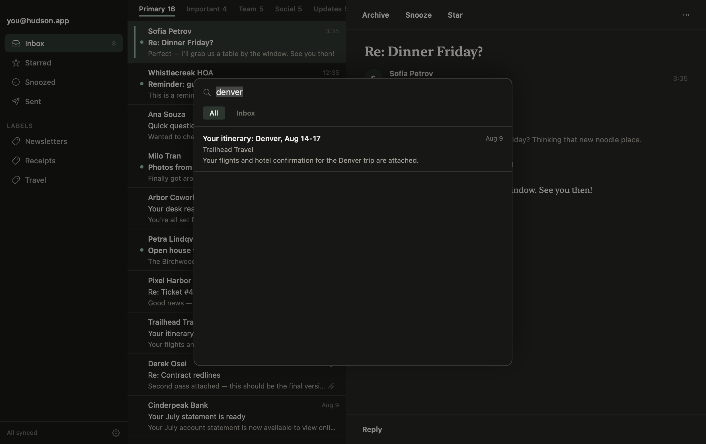

# Running the Hudson Mac app

This is the SwiftUI shell over the headless foundation (M1–M4): a three-pane
mailbox (sidebar / inbox list / reading pane), instant keyboard-first triage,
a ⌘K command palette, and local full-text search. It reads and triages your
already-synced mail; syncing itself still happens from the CLI (`hudson
sync`) until a later milestone wires a "Sync now" affordance into this UI
(see [Stubbed / deferred](#stubbed--deferred-until-a-later-milestone) below).

## Screenshots

Rendered from the `--demo` mailbox (synthetic data — no real mail):

| Main window | Command palette (⌘K) | Search |
|---|---|---|
|  |  |  |

Regenerate them with the offscreen render harness (no display / screen-recording
permission needed — it captures each view's own backing store):

```bash
HUDSON_SNAPSHOT=1 HUDSON_SNAPSHOT_DIR=docs/ui/screenshots \
  swift test --filter SnapshotHarness
```

The harness (`Tests/HudsonUITests/SnapshotHarness.swift`) is a no-op unless
`HUDSON_SNAPSHOT=1`, so it never runs in the normal suite.

## Build and run

Requires macOS 15+ and Xcode 16+ (same prerequisites as the CLI — see the
[root README](../../README.md)).

```bash
swift build
swift run HudsonApp
```

`HudsonApp` opens the SAME database the CLI reads and writes
(`~/Library/Application Support/Hudson/hudson.sqlite` —
`HudsonDatabase.defaultDatabaseURL`), so run the CLI's `hudson auth` +
`hudson sync` first if you want to see real mail. Nothing you do in the app
touches the network — reading and triage (archive/star/mark read) are 100%
local; only the CLI's `hudson sync` and `hudson <verb>` commands ever call
Gmail.

### Demo mode

To explore the UI without a real Google account or any synced mail:

```bash
swift run HudsonApp --demo
# or: HUDSON_DEMO=1 swift run HudsonApp
```

This opens a separate, fixed-path temp database and seeds it with ~40
synthetic threads (`DemoData`) on first launch — entirely fictional senders,
subjects, and bodies on `.example` domains (RFC 2606), never your real
mailbox. Re-running `--demo` reuses the same seeded database rather than
re-seeding it.

## Keyboard map

Every shortcut below is routed by a single pure function, `KeyRouter.route`
(`Sources/HudsonUI/Model/KeyboardMap.swift`), driven by an app-wide `NSEvent`
monitor (`KeyboardMonitor`) rather than SwiftUI's `.onKeyPress` — see that
file's doc comment for why. `KeyboardMapTests` unit-tests every routing rule
below directly, without a live event loop.

### Inbox list (default, no overlay open)

| Key | Action |
|---|---|
| `j` / `k` | Select next / previous thread |
| `↵` or `o` | Open the selected thread in the reading pane |
| `e` | Archive the selected thread |
| `s` | Star / unstar the selected thread |
| `u` | Toggle read / unread |
| `Esc` | Clear the current selection |
| `⌘K` | Open the command palette |
| `⌘F` or `/` | Open search |

Every triage key (`e`/`s`/`u`) enqueues its mutation the same way a click on
the corresponding button would — instantly, optimistically (the row updates
before the (still-local, no-network) write even lands), via
`InboxModel`/`Triage`'s `enqueueMutation` path.

### Command palette (⌘K)

| Key | Action |
|---|---|
| `↑` / `↓` | Move the highlighted command |
| `↵` | Perform the highlighted command |
| `Esc` | Close the palette |
| *(anything else)* | Typed into the query field |

### Search (⌘F or `/`)

| Key | Action |
|---|---|
| `Esc` | Close search |
| *(anything else)* | Typed into the query field |

## Stubbed / deferred until a later milestone

These surfaces are intentionally present but non-functional — tapping them
shows a `Toast` naming when real behavior arrives, never a silent no-op that
could be mistaken for a bug:

- **Sending / replying** (`ThreadView`'s reply bar) — arrives with **M5**.
- **AI summaries** (the "✦ Summarize thread" chip) — arrives with **M7**.
  Hudson ships with zero AI/LLM network calls until then, and even after M7
  those calls only ever happen against an API key you provide yourself.
- **Snooze** — listed in the command palette as "Coming soon"; arrives with
  **M6**.
- **Sidebar nav beyond "Inbox"** (Starred / Snoozed / Sent, and per-label
  filtering) — the sidebar renders these, but only "Inbox" is wired to a
  real Store-backed filter today; Store has no query backing the others yet.
- **"Sync now" from the app itself** — `AppModel.syncNow()` is implemented
  and guarded (never crashes, never blocks the UI; shows a banner asking you
  to run `hudson auth` in Terminal if no account is connected), but nothing
  in this milestone's UI calls it yet — there's no button wired to it. Until
  then, run `hudson sync` from Terminal to pull new mail. This also matches
  Hudson's privacy stance: the only network path in the app is a single,
  user-initiated sync action — never anything automatic.

## Fidelity note

Automated tests prove the assembled `RootView` renders without crashing
(`RenderSmokeTests.rootViewRendersAssembledThreePane`, hosting it in an
`NSHostingView` at 1200×760) and that every keyboard routing rule is
correct (`KeyboardMapTests`). Pixel-level fidelity against the Pencil
design — spacing, color, exact layout — is a live-run, eyeball-driven check
(`swift run HudsonApp --demo`, screenshot, compare), not something a
headless test can assert.
